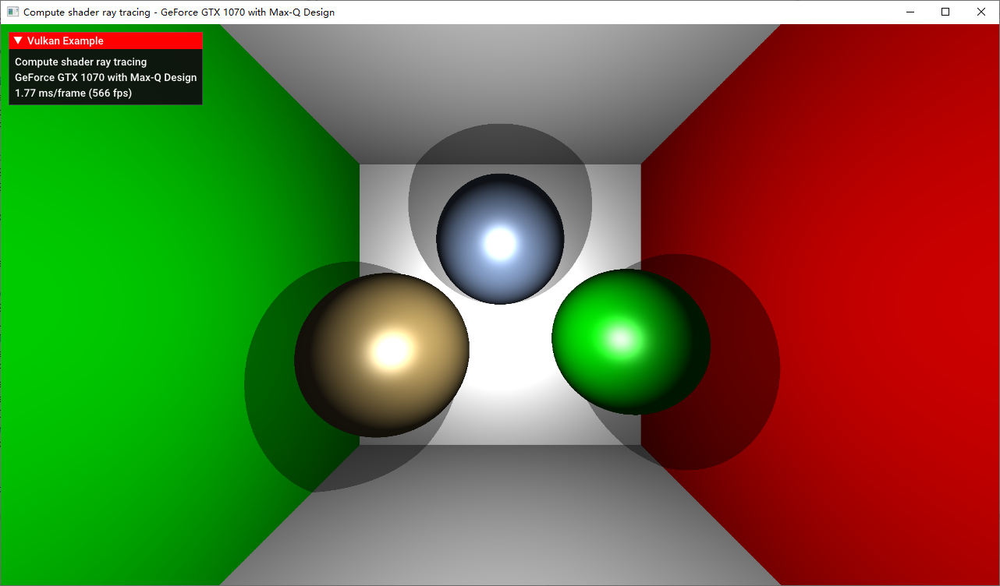
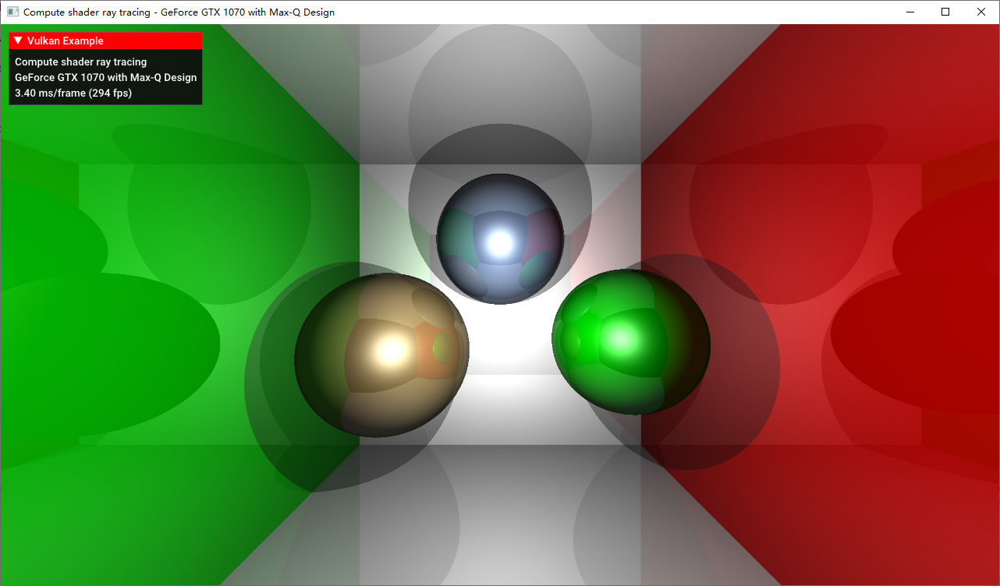
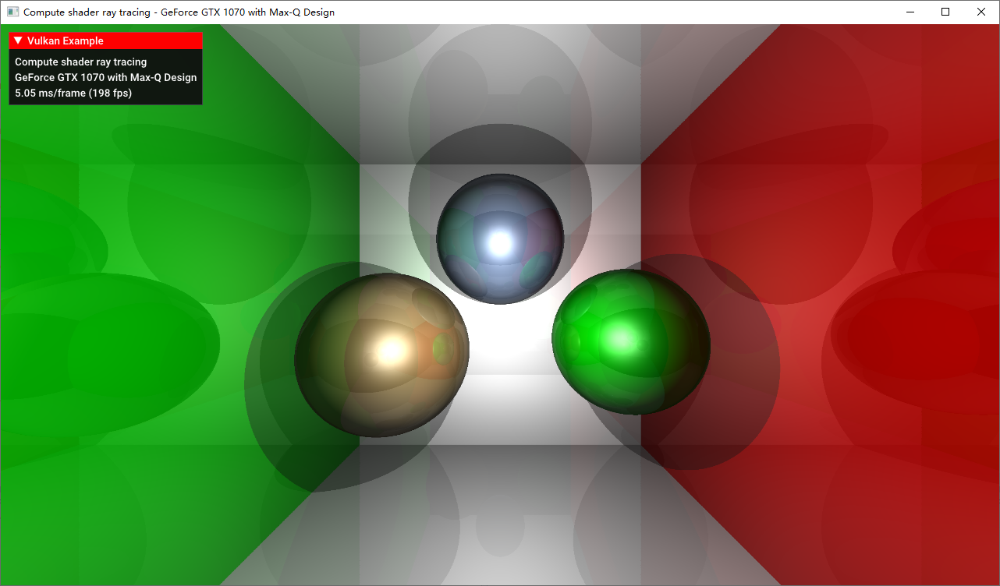

### Compute Shader 简单实现

这里使用 Sascha 的案例 https://github.com/SaschaWillems/Vulkan/blob/master/examples/computeraytracing/computeraytracing.cpp 使用 Compute Shader 建立一个简易的 Ray Tracer 渲染场景。场景没有经过任何光栅化处理，完全是由 Ray Tracer 渲染出来的。

该 Ray Tracer 非常简单，仅仅实现了阴影和反射，没有实现全局光照；场景中用到的物体是定义好的球和平面，并没有做到自定义场景的碰撞检测；不支持物体的材质纹理；没有按照光线追踪的原语实现等。在真实场景中，在 GPU 处理碰撞位置的材质和纹理采样，以及碰撞检测是一个非常难的过程，超出本章范围，但本章实现的简易追踪器已经完全实现了光线追踪的两大要素：光路的生成和光线的碰撞再传播。

#### 光路生成

光路生成发生在 Compute Shader 执行的一开始，这里和图像处理时的策略一样，通过 Group Size 和 Local Size 的组合，我们让每一个像素对应一个 Compute Shader 实例，并且通过 `gl_GlobalInvocationID` 得到当前实例对应的屏幕位置，甚至可以除以屏幕长宽得到一个归一化的“纹理坐标”。由于我们已经完全不需要传统的光栅化流水线了，所以这里我们需要自己结合上摄像机方向和 FOV 属性算出从观察点出射的所有射线的方向。算法如下：

```glsl
vec3 rayD = normalize(vec3((-1.0 + 2.0 * uv) * vec2(ubo.aspectRatio, 1.0), -1.0));
```

完成以后，我们就将跟踪该射线的行为，将在下列章节提及。最终跟踪完毕后，我们得到一个最终颜色值，并将其使用 `imageStore` 写到一张图片中。之后的流程和之前的图像处理案例一样了，最终用一个全屏幕 quad 将这张图绘制到屏幕上。

#### 碰撞和反射

计算出光线的出射点和方向（这里所谓“光线”都是逆着真实光路的，也就是 Eye Ray）后，我们开始进行碰撞检测。这里面用到的所谓碰撞检测非常简单，由于物体都是平面和球体，因此我们只需要遍历场景中的所有物体并按照平面和球体的算法计算其是否碰撞即可，如果由多个碰撞则取距离最近着，即 closest hit。碰撞检测将会得到物体离碰撞点的距离，结合上出射点和方向即可算出碰撞点的位置。

当反射时（此处探讨的均为镜面反射，因为该光追模型只考虑了镜面反射），我们首先算出反射光线的方向，以这个碰撞点作为起点继续进行发射。此处并没有使用递归，而是使用了循环，因为这里不考虑发射多条光线的情况。同时，我们按照光照模型算出该点的颜色值（使用球体或平面的参数进行 Phong 光照模型计算），并按照之前提到的方法向光源发射个光线看是否碰撞到光源（即得到距离是否为光源到该点的距离）来判断此处是否为阴影。

在该案例中，光追模型通过两个全局的变量控制反射的行为：反射强度和反射衰减，并将每一次反射得到的颜色值都和最终颜色值进行混合。反射强度用来控制直接光照的颜色和继续追踪得到的反射颜色的混合比，反射衰减控制每一次反射后反射强度的衰减量：

```glsl
// for each iteration
finalColor = (1.0 - reflectionStrength) * finalColor + reflectionStrength * mix(reflectionColor, finalColor, 1.0 - reflectionStrength);	
reflectionStrength *= REFLECTIONFALLOFF;
```

该案例中还实现了全局线性雾效果。具体实现可以看该案例的 Compute Shader 源代码，很简单。

#### 运行结果

这里放出当反射次数为 0、1、2 时的运行截图。

* BOUNCE = 0：

  对于不加任何反射，光射到物体上直接进行直接光照/阴影即返回值的情况，其运行结果与光栅化没有本质区别。当然，这种方法首先会做到精确阴影，其次由于我们使用的是球体的几何定义而并非三角形拼出来的，此处的球体可以保证不失真（无论分辨率为多少）。

  

* BOUNCE = 1：

  可以看出，墙壁和球体都有整个场景的反射了，并且其反射相比于 Cubemap 要精准很多，不论 Cubemap 是实时的还是离线的。并且，其能够反射到摄像机没有摄到的场景部分，这在屏幕空间的反射算法下是无法做到的。但如果仔细观看，由于我们只允许一次反射，反射出的各个物体只有直接光照，但视觉效果已经足够喜人。
  
  
  
* BOUNCE = 2：

  此时反射出的各个物体也有了一层反射，但由于反射强度和反射衰减的作用，不仔细看是无法分辨出其和上面这张图的区别的，尤其是当整个场景是动态的情况下。因此继续增加反射次数所带来的效果对于视觉的增强是极为有限的。

  

当然，从帧率也可以看出，每增加一次反射次数，处理需求也是有显著的增长。同时，不进行任何光线弹跳时的性能需求也比光栅化要高很多很多。在此处我们的光线追踪模型还非常简陋，若真的加入对整个几何场景的碰撞检测，以及碰撞点的材质和纹理采样的话，性能需求将会多很多。因此在实际应用中，我们在分辨率和弹跳次数上都需要做出妥协，并且使用 Path Tracing 加上 denoise 来进一步减少漫反射光线的数量。若要在实时应用中使用，则可以参考简介一章将光追结合上传统的光栅化实现某些特效，并且使用专属的硬件加速追踪过程。