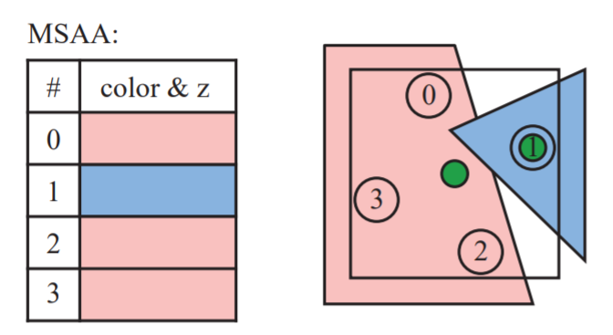

## 多重采样抗锯齿 (MSAA)



MSAA 我们都很熟悉了，其在光栅化一个图元时，在图元的边缘处使用多个采样点覆盖片元，找到能够覆盖到改片元的几个采样点（对于上图红色片元，覆盖到的采样点为 0, 2, 3；对于蓝色片元，覆盖到的采样点为 1），计算出最佳采样位置（对于红色片元，则为像素中心，对于蓝色片元，则为 点 1）进行**一次** Fragment Shading，最终将计算出的颜色值写入到 Multisampled Framebuffer 的对应子像素中。流程图如下：

```
When rendering a primitive:
                            | #0 |                                                    | red
Primitive --(Rasterizer)--> | #2 | --> Find centroid --> Fragment shader --(Output)-> | red
                            | #3 |                                                    | red
- - - - - - - - - - - - - - - - - - - - - - - - - - - - - - - - - - - - - - - - - - - - - - - - - - -
                         <subpixel #1 not inside this primitive>                      | <prev value>
```

若想显示/使用这张 Multisampled Attachment，需要将其 "Resolve" 到一个并没有开启 Multisample 的 Attachment 中。这个 Resolve 过程即把多个采样点合并为一个，避免边缘锯齿。流程图如下：

```
When resolving this multisampled attachment:
#0: red  |
#1: blue | --> pink-ish
#2: red  |
#3: red  |
```

不同于很多后处理抗锯齿算法（FXAA，TAA等），MSAA完全工作在渲染管线中，并且受到硬件支持。

> 一个开了 N 倍 Multisample 的纹理并不会被同类型不开 Multisample  的纹理占 N 倍内存。GPU 会用一些无损压缩方法来减少 Multisample 纹理的大小。同时，对于 TBR 架构的移动芯片，其渲染和 Resolve 阶段都可以直接在片上缓存执行，甚至不会有带宽的负担。

> MSAA 虽然有专门的图形硬件来加速，但其有很多现阶段比较不好解决的痛点，例如无法抗 Shading 锯齿，延迟渲染管线不支持，HDR Buffer 效果差等。
