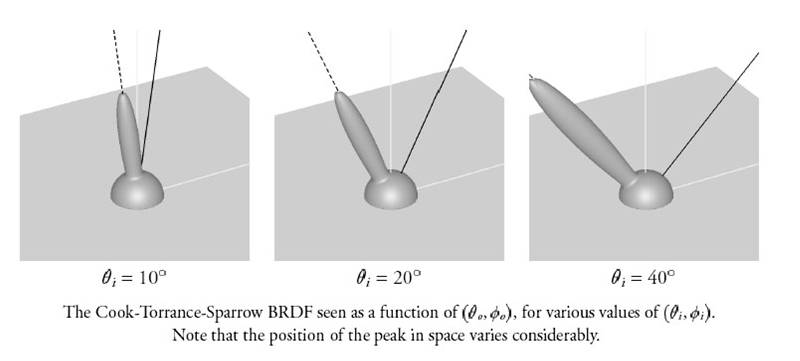

# PBR 通俗理解和直接光照

注意，此章仅以最通俗最简单的方法来理解渲染中常用的 PBR 相关理论，故**仅可做为助记使用**。全网有大量的 PBR 原理推导分析文章，能够从 PBR 的发展和选型，物理原理，反射模型公式推导等诸多更详细的方法全面剖析 PBR 理论，这些优质的资料和引用将在本文文末列举出来。


## 渲染方程

首先看一下渲染方程（此处因为考虑的是直接光照，Visibility 项暂时只考虑直接光源的表面辐射，不考虑光照衰减和遮挡阴影）：

$$L_o(p,\omega_o) = \int\limits_{\Omega} f_r(p,\omega_i,\omega_o) L_i(p,\omega_i) n \cdot \omega_i   \ \mathrm d\omega_i$$

其中 $$p$$ 代表表面上需要着色的点，$$\omega_i$$ 代表输入方向角，$$\omega_o$$ 代表输出方向角，$$n$$ 代表表面的宏观法向量。

用大白话来说，这个公式描述的是从 $$p$$​​ 点向 $$\omega_o$$​​ 方向角出射的光，等于使用 BRDF 算出来的出射能量占入射能量比 $$f_r(p,\omega_i,\omega_o)$$​​，乘上入射光单位面积光通量 $$L_i(p,\omega_i)$$​​，再乘上表面辐射 $$n \cdot \omega_i$$​​。由于要考虑到整个半球面上所有的入射光，因此渲染方程对 $$\omega_i$$​​​ 在整个半球面上做了积分。（有些地方积分域会用 H 符号代替，真正代表半球）

此处我们首先只考虑直接光照，即 $$\omega_i$$​ 为固定方向。间接光照、全局光照同样依赖于这个完整的渲染方程，但此时入射光从四面八方射来，如何**高效/投机取巧完成这个积分**将在后续文章记录。


## BRDF

> 双向反射分布函数(Bidirectional Reflectance Distribution Function,BRDF)是用来定义给定入射方向上的[辐射照度](https://baike.baidu.com/item/辐射照度/2601111)如何影响给定出射方向上的辐射率。更笼统地说，它描述了入射光线经过某个表面反射后如何在各个出射方向上分布这可以是从理想镜面反射到漫反射、各向同性或者各向异性的各种反射。

本质上是一个一维输入，二维输出函数。输入为入射方向 `wi` ，输出为整个半球的出射方向 `wo` 所对应的辐射比率。当我们固定一个出射方向角时，该函数输出的就是该方向输出的光的能量占输入光能量的比值（取值范围 [0, 1]）。所以可以认为，**BRDF 基于物理定义了一个“材质”**。



当前已知材质可以被分为两大种：**金属和电介质**，所以我们可以不针对每一种想要数学建模的材质都定义一个独特的 BRDF，而是可以通过输入一些参数来特例化这两大种材质，这些参数就包括：

* roughness：描述微平面粗糙程度
* metalness / metallic：描述材质的金属“程度”。理论上一个材质要不然就是金属要不然就是电介质，但这里允许 [0, 1] 连续取值是因为这么处理可以模拟那种金属上有灰/划痕等小于一个像素的 footprint 的效果。

顺带说一下，除了“BRDF”之外，还存在 BTDF 双向透射，BSDF 双向散射（也就是结合了反射 BRDF 和投射BTDF），BSSRDF 双向表面散射等，可以统称为 BxDF。


## 金属与电介质

金属和电介质物理性质不太一样，也就是这两种材质对 **“直接反射”** 和 **“折射进物体内部+次表面反射”** 的处理方法不太一样。当光线入射到两种材质表面上时：

* **金属**：立刻捕获所有光，吸收一部分**来产生颜色**，剩下的直接反射走，**没有多少折射**，继而没有多少次表面散射。即所有反射光线都来自于直接反射。（金属表面的自由电子随着入射光振动，终止入射光，产生反射光）
* **电介质 / 绝缘体**：**不怎么直接反射**，几乎所有看到的光都是折射进物体内部+次表面反射贡献的（材料里的电子负责振动）。

牢记这些现象，因为这对于建模光反射的数学模型至关重要。


## Cook-Torrance BRDF

咱们来看看其中一种实时渲染中常见的， Cook 和 Torrance 在1982 年写出来的，**基于微表面理论**的光反射模型（Microfacet BRDF）：

$$f_r = k_d f_{lambert} +  f_{cook-torrance}$$

* "Lambert" 部分：这一部分描述所有**漫反射**的光，而且用的是 Lambert Model。计算非常简单：

  $$f_{lambert} = \frac{c}{\pi}$$

  c 代表漫反射光 diffuse，或者称为 albedo，或者记为 $$c_{diff}$$ 或 $$c_{surf}$$。需要注意，因为在 BRDF 中不需要考虑光源方向辐照度/表面接收到的辐照度（即`dot(n, l)`），所以 Lambert 部分就是一个常量，结合上公式外面那个点乘（即`dot(n, l)`）不就是完整的 Lambert 光照么，这也就是为什么管它叫 Lambert 的原因。

* "Cook Torrance" 部分：

  这部分描述那些非漫反射的高光，这里单独开一章说，要不然项目级数太多了。
  
* kd 为漫反射部分占整个输出光能量的比值，之后会提到如何算高光部分占整个输出光能量的比值 ks。因为能量守恒，可以得知有 $$k_s+k_d=1$$​​​，kd就得出来了。


## 微表面

那什么是微表面呢？一个物体宏观看起来可能是平滑的，但如果用显微镜仔细看物体的表面，会发现其包含下图这种凹凸不平的、无序（是的，这里仅考虑无序的情况）的细小起伏，这种起伏的法线不同于宏观上物体表面的法线，因此其会把光反射到四面八方，这也是为什么物体能够呈现出粗糙的样子。这种起伏太小了，比渲染时的一个像素还要小，因此我们没必要用三角形面片显式建模出来它，而是把它当成渲染时用到的虚拟材质的一种属性，用统计学的方法来还原这种小起伏对光线传播所造成的影响即可。


## Cook Torrance Specular BRDF part

这部分描述那些非漫反射的高光：

$$f_{cook-torrance} = \frac{DFG}{4(\omega_o \cdot n)(\omega_i \cdot n)}$$

看到这个公式不要慌。三大头 D、F、G 从三大不同角度描述了到底怎么个“基于”物理。三个函数均是对其表示的现象的一种**近似**，因此这三个函数也不一定都只有一个版本，这里按照 Unreal Engine 4 的选型来说：

* **D (Normal Distribution Funcion - NDF)：法线分布函数，反映出材质的粗糙程度**

  **选型：Trowbridge-Reitz GGX**，或称为 TR/GGX

  $$NDF_{GGX TR}(n, h, \alpha) = \frac{\alpha^2}{\pi((n \cdot h)^2 (\alpha^2 - 1) + 1)^2}$$
  
  GGX 模型估算了微表面和半程向量 $$h$$ 的对齐程度，从而能够反映出材质的**粗糙程度**。n不用说，就是法向量。h 就是半程向量，即 `normalize(l+v)`。这里 $$\alpha$$ 即是 roughness，也正是因为有 roughness 一说，NDF 的存在才有意义。
  
  NDF 不难理解：当我们的视线正好和反射光线相同（即半程向量正好为宏观物体的表面法线），且平面完全光滑时，反射光线不就都射眼睛里了么，产生大片亮斑；反之则啥也看不见（类似于下图左面的球）。但是因  为有 roughness 的微平面属性存在，半程向量不为宏观物体的表面法线（但和微观的微表面法线相同）时，其实也能看见光！这种关系的描述就是 NDF。
  
  NDF 在这里可能是最能够直接感受到光照效果的部分了：
  
  
  
  顺带说一句，直至今天我依然没找到 GGX 的全称是什么，原始论文中也是为了和 Beckmann 分布比就直接甩出 GGX 三个字母了，不会是滚键盘滚出来的吧？
  
* **G (Geometry Function / Geometric Shadowing)：几何函数，描述微表面的自阴影属性**

  **选型：Smith's Schlick-GGX**

  $$G_{SchlickGGX}(n, v, k)        		 =    		\frac{n \cdot v}    	{(n \cdot v)(1 - k) + k }$$

  当表面足够粗糙时，视线可能因为被遮挡看不到被照到的部分（Geometry Obstruction），光本身也会因为照不到某些地方产生阴影（Geometry Shadowing），如下图所示：

  

  可见这个 Schlick GGX 公式就是处理这种情况使的。公式接受法线、观察方向和一个 k，输出取值范围 [0, 1]。k其实就是 $$\alpha$$ 的一种变形，本质上还是反应了roughness：

  $$k_{direct} = \frac{(\alpha + 1)^2}{8}$$  

  $$k_{IBL} = \frac{\alpha^2}{2}$$

  一切看起来很美好，但是仔细想一下啊，视线可能因为被遮挡看不到被照到的部分（上图红色，Geometry Obstruction），光本身也会因为找不到某些地方产生阴影（Geometry Shadowing），所以上述公式的这个观察方向也要分类讨论为光线方向和视线方向，因此我们用下面这个公式 Smith's Schlick-GGX 统一上面的两种情况:

  $$G(n, v, l, k) = G_{SchlickGGX}(n, v, k) G_{SchlickGGX}(n, l, k)$$

  这里 `v` 即视线，`l` 即光线。该式子的取值范围为 [0, 1]，效果如下（理论上 NDF 和这里 G 的 roughness 都应该是一个，但是这里为了演示，固定了 NDF 的 roughness）：

  

  不要小瞧了这一项：如果没有该项，在视线几乎平行于物体平面（掠射）时，由于下面提到的菲涅尔现象，物体边缘会非常的亮（可以带进高光部分公式试一下），显然是不“物理准确”的。

  更严谨地，由于上述在讨论 Geometry Obstruction 的时候并没有考虑光线虽然被遮挡不被看见，但最终会向其他方向射出的行为，因此会导致越粗糙渲染结果越暗这种不能量守恒的结果。此时可以引入 Kulla-Conty 提出的能量补偿项来修正。此处暂时不考虑。

* **F (Fresnel Equation)：菲涅尔方程，反应一个材质反射和折射光线的比率，能够体现材质的金属度**

  **选型：Fresnel-Schlick 近似**

  $$F_{Schlick}(h, v, F_0) =     F_0 + (1 - F_0) ( 1 - (h \cdot v))^5$$

  上面提到的 NDF 和 GF 其实都从微平面理论来讨论材质属性，而下面的菲涅尔方程则是从材质的物理材料本身（substance）来讨论的。

  菲涅尔方程定义的是在**不同观察方向**上，表面上**被反射的光除以被折射的光的比例**。我们通过该方程可以计算得到被反射的光的能量，根据能量守恒我们就可以得知被折射进物体的光的能量了。那些折射进物体的光也没闲着，他们在物体内进行着称之为**次表面散射（Subsurface Scattering）**的行为，最终会看似随机地射出表面。如下图所示：

  

  其中黄色出射光为直接反射光，红色出射光为次表面反射光。可以看到，在一个平滑的平面上（即不考虑微平面理论），在宏观上来说，反射光即为材质的高光 specular 部分，而次表面反射因为是完全随机出射，所以构成了漫反射 diffuse 部分。

  这里还是得提一句 Subsurface Scattering 的注意事项。先从引擎玩起再来补图形学知识的人可能会疑惑，Subsurface Scattering 不是做皮肤那种，模拟光从一个像素点入射，从另一个像素点出射的物理现象吗？但这里整篇文章模拟的都是一个像素所覆盖的平面所产生的物理属性（还是之前提到的 pixel footprint 的概念），而这种跨越多个像素的、宏观的次表面反射会在后面使用一个单独的物理模型去模拟，即 BSSRDF。

  菲涅尔方程还能够描述一个现象，当然就称为菲涅尔现象（Fresnel Effect）：当对一个平面以近似平行的方法观看的时候，反射比会陡增（Real-time Rendering 4th - p318 配图）。试着把一张打印纸卷成尽量细的纸筒，把纸筒的一侧贴在明亮的显示屏上，顺着纸筒的另一侧看过去，看看靠近显示屏的纸是不是变得更亮了？

  现在我们就需要去用公式描述这两个现象：反射折射，以及菲涅尔现象。当光**垂直入射表面**的时候，被反射和被折射的光的比率可以用**基础反射率**来描述，业内习惯称之为 **F0**。F0 可以根据折射率（Index of Fraction, 或者 [Refractive Index](https://en.wikipedia.org/wiki/Refractive_index)）来得到。

  那 F0 对于不同材质的取值到底是多少呢？在上面“金属和电介质”一章中也已经提到，电介质几乎不直接反射，而金属几乎是直接反射。这个特性直接体现在 F0 上：

  * 金属：F0 在 0.5~1.0 区间中，并且对于每个波长的可见光来说 F0 值都不一样，这也是为什么**金属的高光颜色会受其本身颜色影响**。
  * 电介质：F0 平均值在 0.04 左右（所以说几乎不怎么直接反射，但也是反射一点点的）。对于每个波长的可见光来说 F0 值都差不多，这也是为什么电介质的高光颜色不受其本身颜色影响，即**光源什么颜色高光部分就是什么颜色**。
  
  常见材质的 F0 如下表（截图自 [LearnOpenGL](https://learnopengl-cn.github.io/07%20PBR/01%20Theory/)），看看是不是符合上述物理规则：
  
  
  
  对于菲涅尔现象，看公式不难看出来，其实就可以用 $$(1 - F_0) ( 1 - (h \cdot v))^5$$ 来近似，再加上基础反射率 F0 即构成了整个 Fresnel-Schlick 近似版本的菲涅尔方程。
  
  公式运算完毕的值 F（这里就是 $$F_{Schlick}(h, v, F_0)$$​​ 的简写）其实就是之前提到的**高光部分占整个输出光能量的比值** ks。于是 kd 也可以随即用  1-ks（即 1-F )算出来。


## PBR 资产

其实到现在，之前一直提到的一个参数 metalness / matallic 一直没被用到，而被反复用到的一个参数叫 F0。用过商业引擎的人也都知道，在引擎的 PBR 材质主节点上也没有这个 F0 的参数。同时讲了半天，对于美术来说最重要的材质颜色同样没有体现在模型中。那么怎么从暴露出来的 metalness 和材质颜色（Base Color, 或称 Albedo）转化为 F0 呢？

这里再复习一下到底是谁决定了物体的颜色：

* 金属：全部为 F0，kd = 0。入射的一瞬间金属表面吸收不同波长的光（产生材质的颜色）并**直接反射**。
* 电介质： 几乎全是次表面散射的贡献值 kd，只有一小小部分为F0（因为毕竟平均还有 0.04 呢嘛）。

看来 F0 和 kd 的混合就可以做到让这套算法兼容两者：

```c
F0 = mix(vec3(0.04), albedo, metallic); // using metallic to lerp between 0.04 and albedo
```

当然，虽然电介质的 F0 仅仅只有 0~0.08，但如果一概而论都按照 0.04 算也能让人在潜意识上觉得似乎不那么“基于物理”了。因此这里也需要一个能够指定电介质 F0 的参数。但由于直接开放 F0 的话，不懂原理的美术可能直接输入一个超过 0.08 的值，因此我们可以将 [0, 0.08] 映射到 [0, 1]，该值被称为 Specular。

综上，对于一个材质面板来说，和 PBR 有关系的属性如下：

* Albedo / Base Color：颜色值。当纯金属时该值直接代表了 F0，纯电介质时代表了散射颜色 kd。
* Metalness / Metallic：金属度。取值范围 [0, 1]。
* Roughness：粗糙度，决定着微平面属性。取值范围 [0, 1]。
* Specular：对应电介质的 F0。如果材质完全是金属该值则会被忽略。取值范围 [0, 1]。

### Unreal Engine 4

UE4 引擎中材质蓝图的 Lit 着色模型遵循上述 PBR 属性（因为就是按照UE4写的- -）。上述公式体现在 `ShadingCommon.ush` 和 `BRDF.ush` 中。

### Unity

Unity 默认提供了两套标准 PBR 材质面板（Shader + CustomEditor），一切通过纹理调参进行，类似于 UE 中的 Material Instance：

* Standard：提供 Albedo，Metallic，Smoothness (即1-Roughness)，和上述情况类似。只是电介质的 F0 不能被修改，而恒定到 0.04 了。

* Standard (Specular Setup)：将 Metallic 替换为了 Specular，即使用 Specular 工作流。

  不同于刚刚提到的 Metallic 工作流，在 Specular 工作流中，**Albedo 完全代表了漫反射 kd，而 Specular 值则完全代表了 F0**。没有了上述 Lerp 的限制，Albedo 和 Specular 的值是否物理准确完全取决于美术调参，也就是说美术为了实现风格化渲染可以把 Albedo 和 Specular 都调成一个很亮的颜色。是的，我认为此种将 kd 和 F0 不加约束直接暴露出来的做法，在想略微实现一点不物理准确的风格化渲染时可能会有用，但如果追求基于物理的渲染，并且不会一不小心把参数调的“不物理准确”的话，这里还是强力推荐使用业界公认的 Metallic 工作流。

Unity 官方对两种工作流的差别可以参考[官方doc](https://docs.unity3d.com/Manual/StandardShaderMaterialCharts.html)。

对于 Unity 自带的两套 SRP（URP、HDRP）的 Lit 材质来说，它们都配置也都同上（也都包含两套工作流）。同时，如果安装了官方或第三方 Shader Graph 插件时，Lit 材质主节点也是至少有这两套工作流的。


## 实现

这里记录一下 LearnOpenGL 中 PBR 直接光照的基础实现，放在这里纯是因为看着方便：

https://learnopengl.com/code_viewer_gh.php?code=src/6.pbr/1.1.lighting/1.1.pbr.fs

```c
const float PI = 3.14159265359;
float DistributionGGX(vec3 N, vec3 H, float roughness) {
    float a = roughness*roughness;
    float a2 = a*a;
    float NdotH = max(dot(N, H), 0.0);
    float NdotH2 = NdotH*NdotH;

    float nom   = a2;
    float denom = (NdotH2 * (a2 - 1.0) + 1.0);
    denom = PI * denom * denom;

    return nom / max(denom, 0.001); // prevent divide by zero for roughness=0.0 and NdotH=1.0
}

float GeometrySchlickGGX(float NdotV, float roughness) {
    float r = (roughness + 1.0);
    float k = (r*r) / 8.0;

    float nom   = NdotV;
    float denom = NdotV * (1.0 - k) + k;

    return nom / denom;
}

float GeometrySmith(vec3 N, vec3 V, vec3 L, float roughness) {
    float NdotV = max(dot(N, V), 0.0);
    float NdotL = max(dot(N, L), 0.0);
    float ggx2 = GeometrySchlickGGX(NdotV, roughness);
    float ggx1 = GeometrySchlickGGX(NdotL, roughness);

    return ggx1 * ggx2;
}

vec3 fresnelSchlick(float cosTheta, vec3 F0) {
    return F0 + (1.0 - F0) * pow(1.0 - cosTheta, 5.0);
}
```

```c
#version 330 core
out vec4 FragColor;
in vec2 TexCoords;
in vec3 WorldPos;
in vec3 Normal;

// material parameters
uniform vec3  albedo;
uniform float metallic;
uniform float roughness;
uniform float ao;

// lights
uniform vec3 lightPositions[4];
uniform vec3 lightColors[4];

uniform vec3 camPos;

const float PI = 3.14159265359;
  
float DistributionGGX(vec3 N, vec3 H, float roughness);
float GeometrySchlickGGX(float NdotV, float roughness);
float GeometrySmith(vec3 N, vec3 V, vec3 L, float roughness);
vec3 fresnelSchlick(float cosTheta, vec3 F0);

void main() {		
    vec3 N = normalize(Normal);
    vec3 V = normalize(camPos - WorldPos);

    vec3 F0 = vec3(0.04); 
    F0 = mix(F0, albedo, metallic);
	           
    // reflectance equation
    vec3 Lo = vec3(0.0);
    for(int i = 0; i < 4; ++i) 
    {
        // calculate per-light radiance
        vec3 L = normalize(lightPositions[i] - WorldPos);
        vec3 H = normalize(V + L);
        float distance    = length(lightPositions[i] - WorldPos);
        float attenuation = 1.0 / (distance * distance);
        vec3 radiance     = lightColors[i] * attenuation;        
        
        // cook-torrance brdf
        float NDF = DistributionGGX(N, H, roughness);        
        float G   = GeometrySmith(N, V, L, roughness);      
        vec3 F    = fresnelSchlick(max(dot(H, V), 0.0), F0);       
        
        vec3 kS = F;
        vec3 kD = vec3(1.0) - kS;
        kD *= 1.0 - metallic;
        
        vec3 numerator    = NDF * G * F;
        float denominator = 4.0 * max(dot(N, V), 0.0) * max(dot(N, L), 0.0);
        vec3 specular     = numerator / max(denominator, 0.001);  
            
        // add to outgoing radiance Lo
        float NdotL = max(dot(N, L), 0.0);                
        Lo += (kD * albedo / PI + specular) * radiance * NdotL; 
    }   
  
    vec3 ambient = vec3(0.03) * albedo * ao;
    vec3 color = ambient + Lo;
	
    color = color / (color + vec3(1.0)); // Tonemapping using Reinhard
    color = pow(color, vec3(1.0/2.2)); // Gamma Correction，这两部如果走HDR Color Attachment的话可以后处理做，如果走纯Gamma工作流就需要材质输出的时候做，类似于Unity的Gamma和Linear色彩空间设定。
   
    FragColor = vec4(color, 1.0);
}  
```


## 后记

保姆级 PBR 教程：https://www.cnblogs.com/timlly/p/10631718.html

Google Filament：https://google.github.io/filament/Filament.html

Epic Games 在 SIGGRAPH 上的 ppt：https://cdn2.unrealengine.com/Resources/files/2013SiggraphPresentationsNotes-26915738.pdf

LearnOpenGL：https://learnopengl.com/PBR/Lighting

SIGGRAPH:

* [SIGGRAPH University - Introduction to "Physically Based Shading in Theory and Practice"](https://www.youtube.com/watch?v=j-A0mwsJRmk)

* [Physically Based Shading in Theory and Practice](https://www.youtube.com/watch?v=zs0oYjwjNEo)

商业引擎/渲染器中实现 PBR 的链接：

* https://docs.unity3d.com/Packages/com.unity.render-pipelines.universal@11.0/manual/shading-model.html

* https://marmoset.co/posts/physically-based-rendering-and-you-can-too/